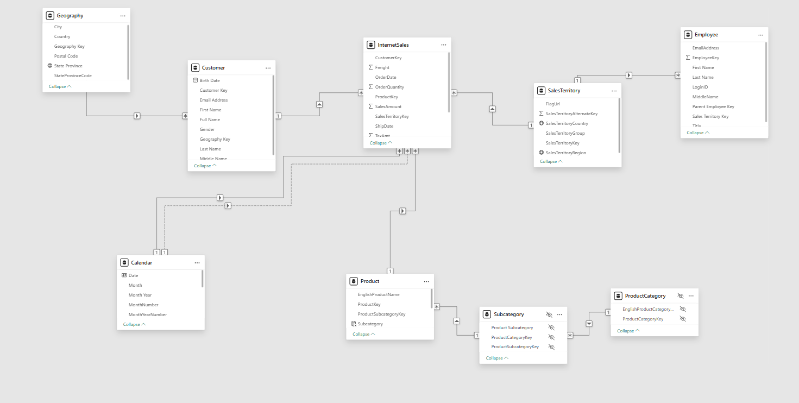
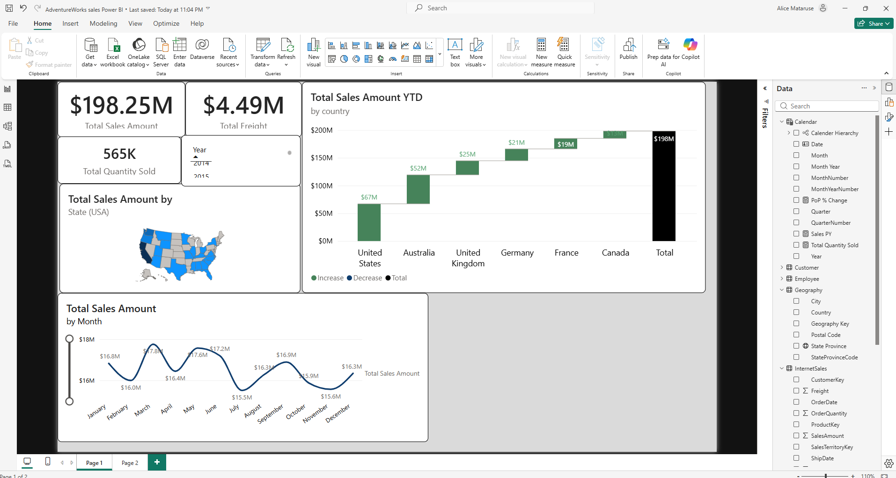

# AdventureWorks-sales-dashboard-powerbi
Interactive Power BI dashboard analyzing sales performance across countries, time, and regions

# Sales Performance Dashboard (Power BI)

## Overview
This project presents an interactive Power BI dashboard used to analyze sales performance across different dimensions, including geography, time, and product categories. The goal is to provide both a high-level summary and more detailed insights into sales trends.

## Objectives
- Summarize overall sales performance using key metrics
- Identify which regions contribute most to total sales
- Analyze how sales change over time
- Explore geographic patterns, with a focus on the United States

## Dashboard Features

### KPI Cards
- Total Sales: $198.25M  
- Total Freight: $4.49M  
- Total Quantity Sold: 565K  

### Waterfall Chart
The waterfall chart shows how each country contributes to total sales. It helps illustrate how individual values build up to the overall total.

### Monthly Sales Trend
A line chart is used to display monthly sales performance. This makes it easier to observe trends and fluctuations throughout the year.

### Geographic Analysis
A map visualization focuses on sales performance across U.S. states, highlighting regional differences.

## Tools Used
- Power BI  
- DAX (Data Analysis Expressions)  
- Data Modeling  

## Data Model

The data model is designed using a star schema structure, with the InternetSales table as the central fact table. It is connected to multiple dimension tables, including Customer, Product, Geography, Calendar, and Sales Territory.

This structure allows efficient filtering, aggregation, and analysis across different dimensions such as time, location, and product categories.

## Key Insights
- The United States contributes the largest share of total sales  
- Sales vary across months, with noticeable peaks and declines  
- Some regions outperform others, suggesting opportunities for targeted strategies  

## Dashboard Preview

## Author
Alice Mataruse Mataruse  
MS Business Analytics
